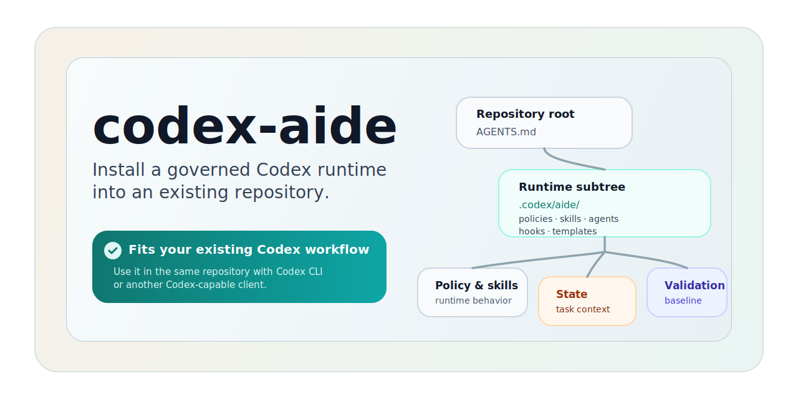

<p align="center">
  
</p>

<h1 align="center">codex-aide</h1>

<p align="center">
  <strong>给使用 Codex 的项目装上由 Aide 管理的工作流与治理层。</strong>
</p>

<p align="center">
  适合希望让 AI 工作按统一流程运行，而不是依赖零散 prompt 和个人习惯的项目。如果你平时通过 <strong>Codex CLI</strong> 或兼容客户端工作，codex-aide 会让 <strong>Aide</strong> 通过 Codex 来管理任务入口、路由、状态、治理、验证与交付。
</p>

<table align="center">
  <tr>
    <td align="center"><a href="#quick-start"><strong>快速开始</strong></a></td>
    <td align="center"><a href="#installation"><strong>安装方式</strong></a></td>
    <td align="center"><a href="#built-for-codex"><strong>适用于 Codex</strong></a></td>
    <td align="center"><a href="#repository-docs"><strong>文档</strong></a></td>
    <td align="center"><a href="../README.md"><strong>English</strong></a></td>
  </tr>
</table>

如有歧义，以 [英文主文件](../README.md) 为准。

## ✨ 为什么用 codex-aide

很多 Codex 用法一开始都来自零散 prompt、手工复制的说明和临时规则。在单个项目里短期还能运转，但一旦要把同一套工作方式复用到多个项目里，并持续管理跨会话长任务，这种方式就很难保持一致。

`codex-aide` 做的事，就是把这些约定收拢成一套可以安装进项目的工作流与治理层：

- 在项目里保留一个稳定入口，让 Codex 默认按 `Aide` 工作
- 让任务入口、路由、状态、治理、验证和交付进入同一套由 `Aide` 管理的流程
- 为长任务和跨会话协作保留持续可用的状态与上下文
- 给团队提供一套更容易审阅、刷新和复用的治理结构
- 让安装和后续刷新都有一条可重复执行的路径

| 没有 codex-aide | 使用 codex-aide |
| --- | --- |
| 每个项目都要重新定义和维护 AI 的工作方式 | 一套由 `Aide` 管理的基线可以复用到多个项目 |
| 功能实现的上下文随着对话增长容易偏离、出错 | `Aide` 通过状态、路由和治理规则把实现上下文稳定在同一条链路上 |
| 长任务跨会话推进时，任务状态和上下文容易跑偏 | 任务状态、上下文和进度能持续保留下来 |
| 开发、测试和交付更多靠人围着 AI 临时协调 | `Aide` 自带一致、可治理的工作流基线，把开发、测试和交付串起来 |

<h2 id="quick-start">🚀 快速开始</h2>

要求：

- 通过 npm 安装时需要 Node.js `>=20`
- 目标项目需要通过 Codex CLI 或兼容 Codex 的客户端使用

从下面任选一种安装方式。

<h2 id="installation">📦 安装方式</h2>

<table>
  <tr>
    <td align="center" width="33%">
      <strong>📦 npm 安装</strong><br />
      标准且最快的路径
    </td>
    <td align="center" width="33%">
      <strong>🌐 git 安装</strong><br />
      拉取 starter 后直接复制
    </td>
    <td align="center" width="33%">
      <strong>🤖 AI 安装</strong><br />
      让 coding agent 代为完成安装
    </td>
  </tr>
</table>

### 1. npm

适合本地可以直接使用 Node.js 的情况。

```bash
npm i -g @icellus/codex-aide
cd /path/to/your/project
codex-aide install
```

可选参数：

```bash
codex-aide install --target /path/to/project
codex-aide install --dry-run
```

### 2. 通过 git 安装

适合你希望直接拉取 starter，并自己把文件落到项目里的情况。

```bash
git clone --depth 1 https://github.com/icellus/codex-aide.git /tmp/codex-aide
cd /tmp/codex-aide

cp starter/AGENTS.md /path/to/project/AGENTS.md
mkdir -p /path/to/project/.codex
cp starter/config.toml /path/to/project/.codex/config.toml
cp starter/hooks.json /path/to/project/.codex/hooks.json
cp -R starter/aide /path/to/project/.codex/aide
```

这条路径使用的是同一套 starter 结构，但不会自动应用安装器的合并和保留逻辑。

### 3. 通过 AI 安装

适合你希望让 coding agent 在当前项目里直接完成安装的情况。

把下面这句指令发给你的 agent：

```text
Follow https://raw.githubusercontent.com/icellus/codex-aide/master/INSTALL.md to install codex-aide into the current project.
```

安装说明位于 [INSTALL.md](../INSTALL.md)。

<h2 id="what-gets-installed">🧱 安装后会得到什么</h2>

发布包里带的是下面这套 starter 结构：

```text
starter/AGENTS.md
starter/aide/AGENTS.md
starter/aide/**
```

安装器会把它映射到目标仓库中：

```text
starter/AGENTS.md      -> <repo>/AGENTS.md
starter/config.toml -> <repo>/.codex/config.toml
starter/hooks.json       -> <repo>/.codex/hooks.json
starter/aide/AGENTS.md -> <repo>/.codex/aide/AGENTS.md
starter/aide/**        -> <repo>/.codex/aide/**
```

这样做是为了让项目根目录尽量保持轻量，把 Codex Aide 的相关文件集中在 `.codex/aide/` 下，并由根合同把日常 AI 工作流的管理权交给 `Aide`。

如果你使用的是 Codex CLI，安装器还会补齐 `.codex/hooks.json`，并在 `.codex/config.toml` 里种上 `codex_hooks = true` 和 `multi_agent = true`，用来接通 hook 驱动的工作流。同一项目里如果 Codex 仍然没有读取本地 `config.toml`，需要在 `~/.codex/config.toml` 里启用这两个 feature，或者用 `codex --enable codex_hooks --enable multi_agent` 启动。

<h2 id="built-for-codex">🧭 适用于 Codex</h2>

`codex-aide` 是给使用 Codex 的项目准备的，重点之一就是把 `Aide` 管理的工作流与治理能力装进项目，并让 Codex 默认通过 `Aide` 工作。它不是独立 GUI 产品，也不是通用 prompt 包。

要让安装后的工作流真正发挥作用，最好通过下面这类客户端使用仓库：

- Codex CLI
- 能读取仓库说明文件，并实际使用这套已安装目录的兼容客户端

如果客户端不读取仓库说明，或者根本不会使用安装后的这套目录，那 `codex-aide` 的效果就会很有限。

如果 Codex 本来就是你在项目里的默认工作方式，`codex-aide` 的作用就是让 `Aide` 通过 Codex 来管理这套项目工作流，而不是另外再造一套产品。

### 与其他 skill 的兼容

`codex-aide` 可以和其他已安装 skill 共存。它会把文件和状态集中留在 `.codex/aide/` 下，而默认行为仍由项目根合同和 `Aide` 角色合同决定，所以默认情况下，共存本身没有问题。

一般来说，下面这些情况比较适合：

- 你希望项目里的 AI 工作遵循一套默认流程，而不是依赖每个人自己的使用习惯
- 其他 skill 可以共存，但不会成为 `codex-aide` 文件和决策的默认 owner
- 你希望得到一套可安装、可重复刷新的治理与交付基线，而不是每次手工重搭

下面这些情况通常就不太适合：

- 客户端不会读取仓库说明，也不会实际使用安装后的这套目录
- 还有另一套系统也想成为同一批 route、state、governance 决策的项目级默认权威
- 你希望另一个 skill 默认接管 `.codex/aide/**` 这套文件树
- 你只是想要一小段 prompt，而不是一套真正安装进仓库的工作流

<h2 id="repository-docs">📚 文档</h2>

- [English](../README.md)
- [安装说明](../INSTALL.md)
- [贡献指南](CONTRIBUTING.zh-CN.md)
- [测试说明](TESTING.zh-CN.md)
- [安全策略](SECURITY.zh-CN.md)
- [支持说明](SUPPORT.zh-CN.md)
- [行为准则](CODE_OF_CONDUCT.zh-CN.md)

这个项目的一些仓库结构思路，参考了社区中的一些实践，其中包括 [agents-zone-skillset](https://github.com/lipingtababa/agents-zone-skillset)。

## 🛠 仓库维护

如果你维护的是这个仓库本身，请直接从 Git 仓库工作，并在仓库目录里运行下面这些命令。

```bash
git clone https://github.com/icellus/codex-aide.git
cd codex-aide
node scripts/validate-codex-aide-dev.mjs full
npm pack --dry-run
```

## 许可证

MIT
